<div align="center">

# RIPPLE

### Software Supply Chain Attack Surface Scanner

**See how far one risky dependency can ripple through your build.**
Read-only. Offline by default. Every score explained.

     

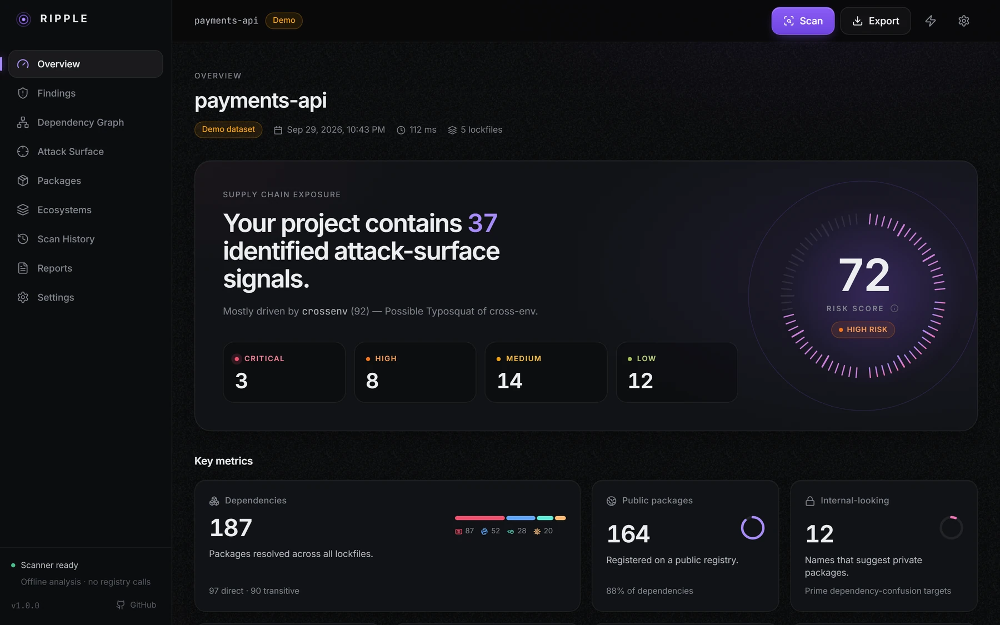

</div>

RIPPLE reads the lockfiles you already have (**npm, PyPI, Go, Rust**), models every direct and transitive dependency, and scores four kinds of supply-chain exposure: **dependency confusion**, **typosquatting**, **suspicious package metadata** and **registry exposure**. Every score is a sum of named, explainable drivers. There are no opaque numbers.

It ships as a Python CLI (the scanning engine), a FastAPI service, and a React dashboard designed to be pleasant to live in.

> **Responsible use.** RIPPLE is for *authorized* security assessment of software you own or are engaged to review. It is strictly read-only: it never registers, publishes, installs, builds or executes any package, and its only network traffic (opt-in, `--live`) is rate-limited `GET` requests to public registry metadata endpoints.

**Contents:** [Features](#features) · [Screenshots](#screenshots) · [Architecture](#architecture) · [Installation](#installation) · [Quick Start](#quick-start) · [CLI Usage](#cli-usage) · [Dashboard](#dashboard) · [Supported Ecosystems](#supported-ecosystems) · [Detection Methodology](#detection-methodology) · [Risk Scoring](#risk-scoring) · [SARIF](#sarif) · [Security Model](#security-model) · [Demo](#demo) · [Testing](#testing) · [Limitations](#limitations) · [Responsible Use](#responsible-use) · [License](#license)

---

## Screenshots

<table>
<tr>
<td width="50%">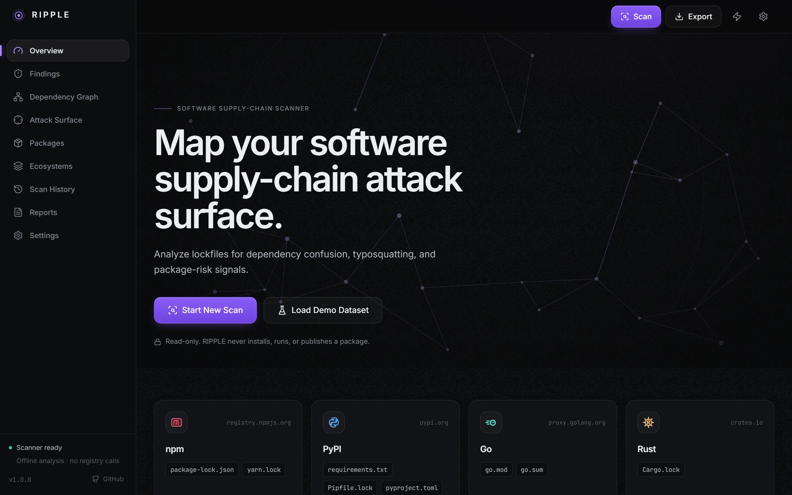<br><sub><b>Onboarding.</b> Start a scan or load the offline demo dataset.</sub></td>
<td width="50%">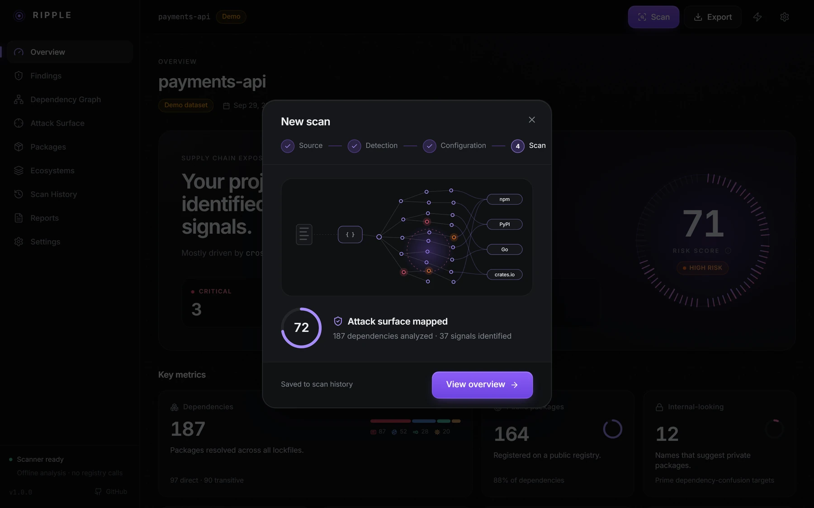<br><sub><b>Scan workflow.</b> Progress reflects the engine's real stages, not a timer.</sub></td>
</tr>
<tr>
<td width="50%">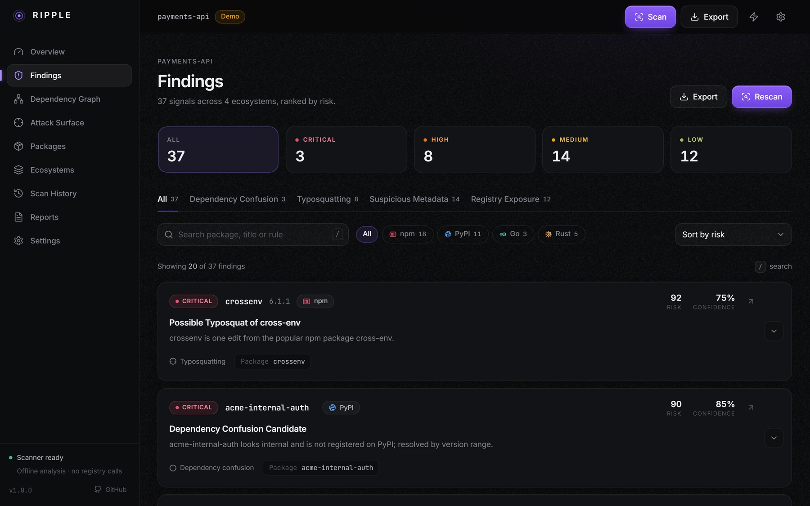<br><sub><b>Findings.</b> Ranked by risk, filterable by severity, category and ecosystem.</sub></td>
<td width="50%">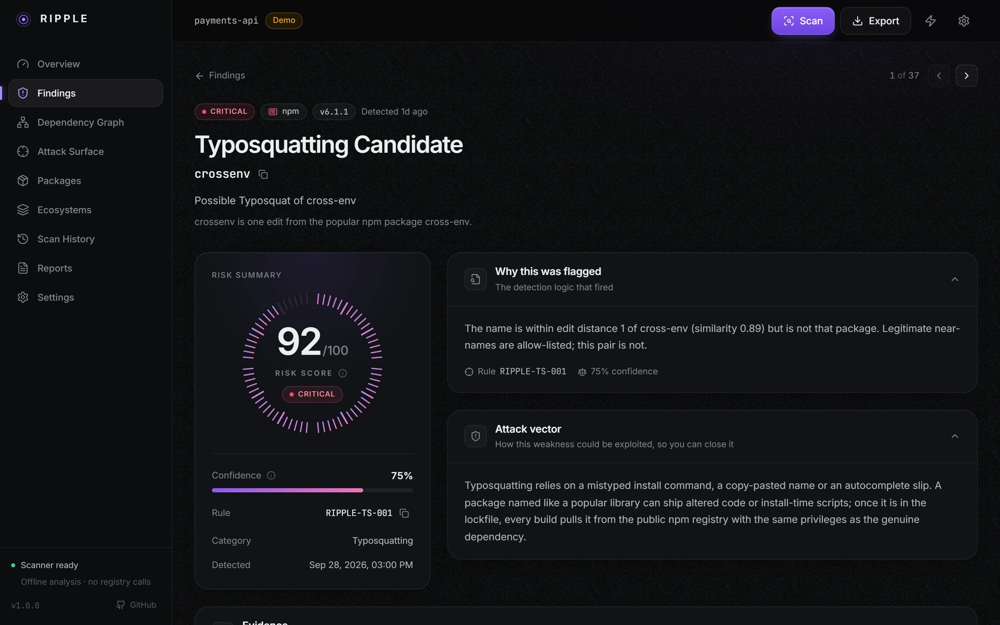<br><sub><b>Finding detail.</b> Why it was flagged, attack vector, evidence, drivers, remediation.</sub></td>
</tr>
<tr>
<td width="50%">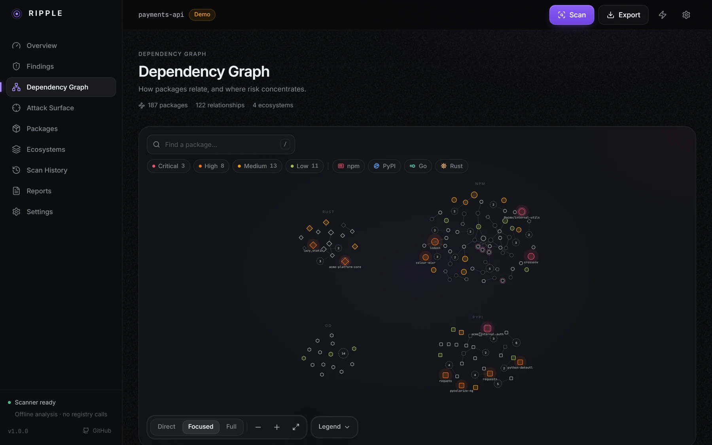<br><sub><b>Dependency graph.</b> Risk, ecosystem and package type encoded in each node; clustering keeps large graphs readable.</sub></td>
<td width="50%">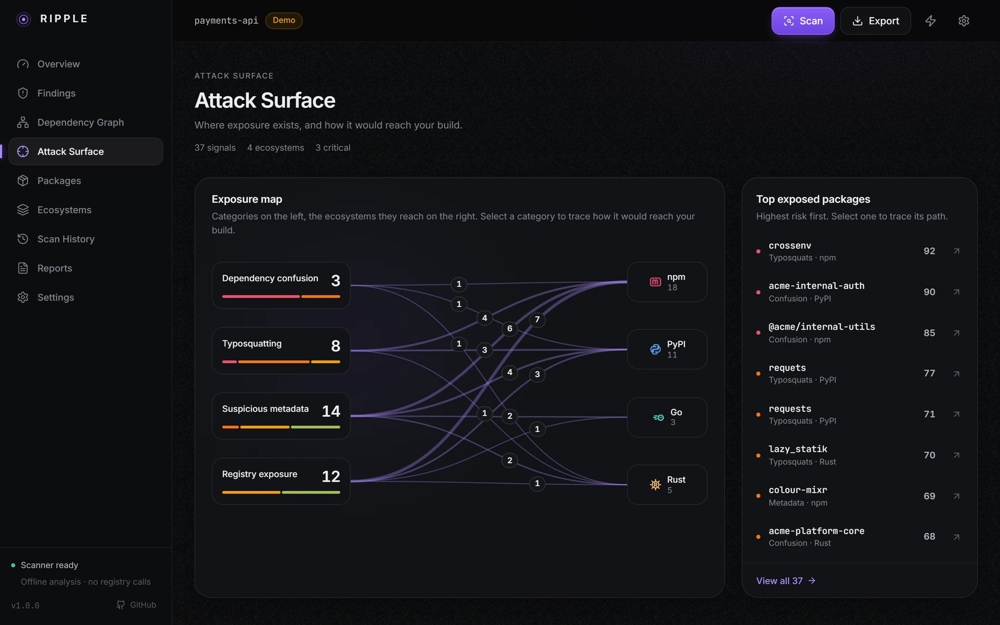<br><sub><b>Attack surface.</b> Which exposure categories reach which ecosystems.</sub></td>
</tr>
<tr>
<td width="50%">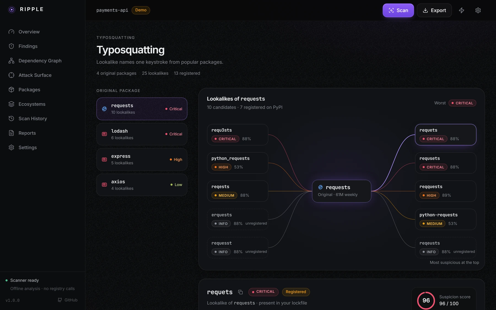<br><sub><b>Typosquatting.</b> Look-alike candidates around a popular package, with registration facts and suspicion scores.</sub></td>
<td width="50%">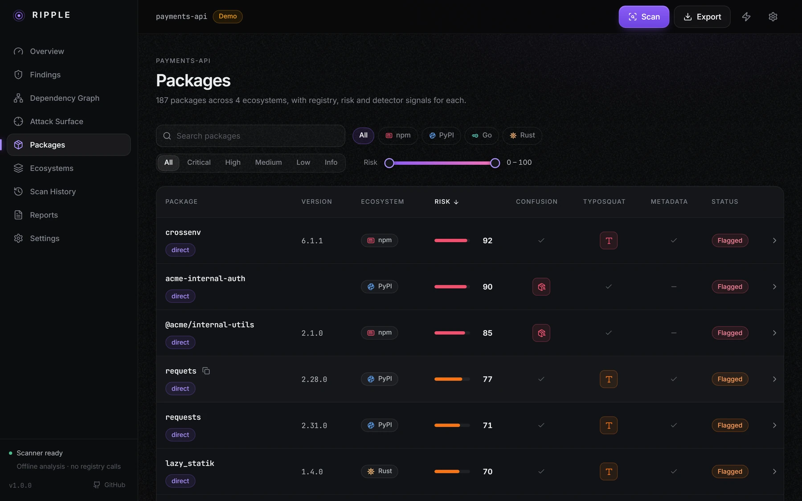<br><sub><b>Package explorer.</b> Search, filter, sort and drill into every dependency.</sub></td>
</tr>
<tr>
<td width="50%">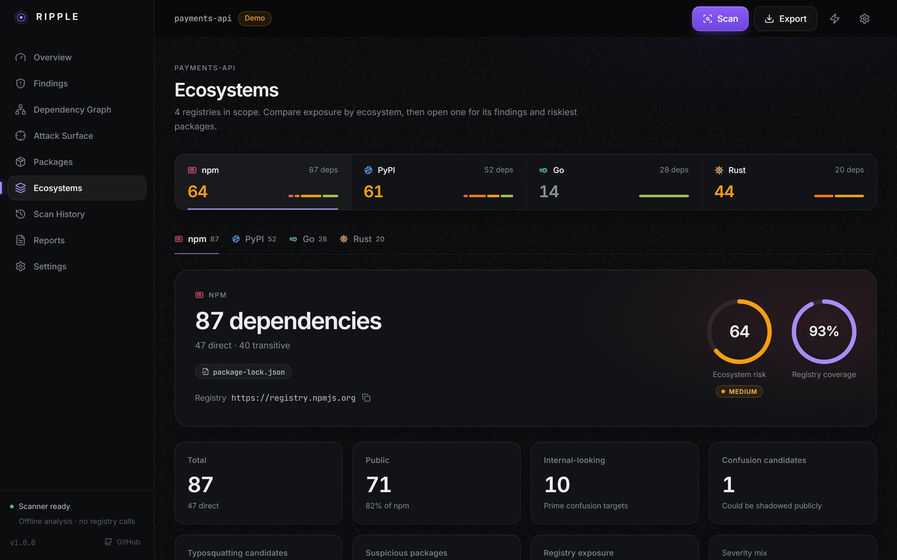<br><sub><b>Ecosystems.</b> Per-registry exposure, coverage and risk.</sub></td>
<td width="50%">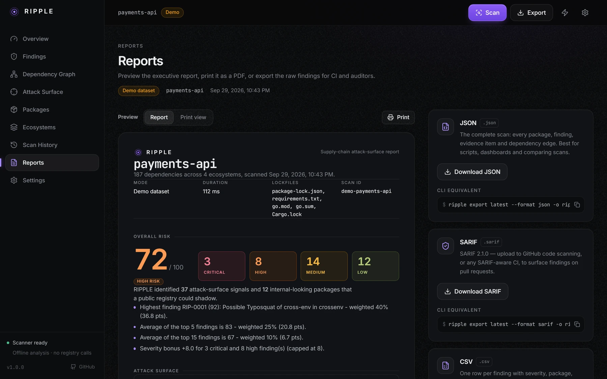<br><sub><b>Reports.</b> JSON, SARIF, CSV and a print-ready executive report.</sub></td>
</tr>
</table>

<p align="center">
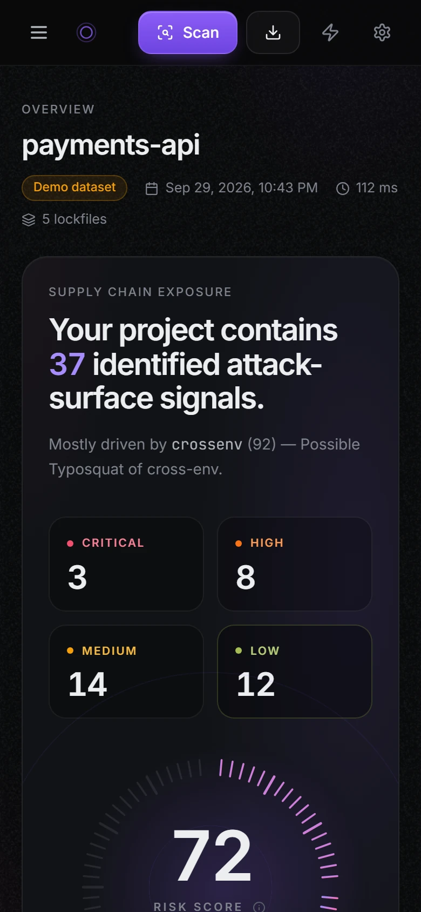
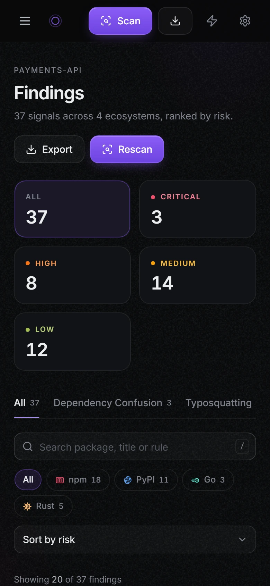
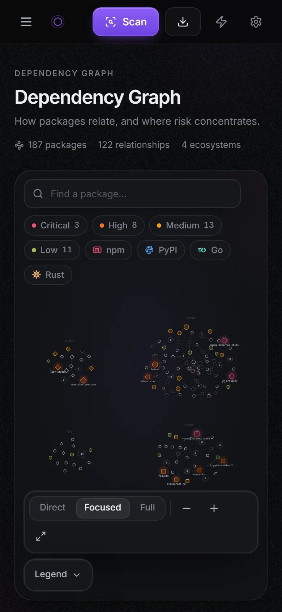
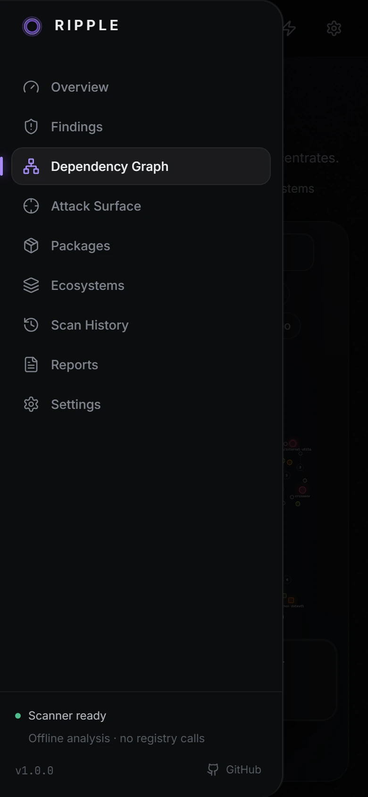
</p>
<p align="center"><sub>Responsive by design: the sidebar becomes a drawer, tables become cards, the graph stays pannable and zoomable.</sub></p>

---

## Features

- **Four detection families** with per-finding evidence, "why flagged", attack vector (defender framing) and ordered remediation steps.
- **Transparent risk scoring**: each finding carries a `drivers[]` list (`+30 Internal-looking name`, `-10 Pinned with integrity hash`, ...) that sums to its 0-100 score; the overall score is explained the same way.
- **Offline by default.** Heuristics work from the lockfile alone; `--live` adds read-only registry lookups (rate-limited, cached, retry-aware).
- **Multi-ecosystem**: npm, PyPI, Go modules, Rust crates - one combined attack-surface model and dependency graph.
- **Rich CLI** with live per-stage progress, severity tables, per-ecosystem breakdown and finding deep-dives.
- **Web dashboard** (React) with attack-surface views, typosquat look-alike explorer, dependency graph, history and settings.
- **CI-ready**: `--fail-on <severity>` exit codes, **SARIF 2.1.0** for GitHub code scanning, JSON, CSV (formula-injection safe) and a print-ready standalone HTML report.
- **Safe by construction**: HTTP client refuses everything except `GET`/`HEAD`; uploaded lockfiles are only ever parsed as data; the API binds to localhost, rejects foreign `Host`/`Origin` headers, caps uploads at 25 MB and never returns stack traces.

## Architecture

```
ripple/                         repo root
+-- pyproject.toml              package `ripple-scanner`, console script `ripple`
+-- ripple/                     Python package
|   +-- models/                 pydantic data contract (Package, Finding, ScanResult, JobStatus, ...)
|   +-- parsers/                package-lock.json, yarn.lock, requirements.txt, Pipfile.lock, pyproject.toml,
|   |                           poetry.lock, uv.lock, go.mod/go.sum, Cargo.lock  ->  Package objects
|   +-- registries/             npm / PyPI / Go proxy / crates.io clients (GET-only), disk+memory cache,
|   |                           offline fixture registry
|   +-- scanners/               confusion, typosquatting, metadata, exposure
|   +-- scoring/                driver-based risk scoring
|   +-- engine.py               run_scan(): parse -> discover -> registry -> typosquat -> metadata -> score -> graph
|   +-- demo/                   deterministic, fully synthetic "payments-api" dataset
|   +-- reports/                rich.py  json.py  sarif.py  csv.py  html.py
|   +-- cli/                    Typer app: app.py, commands/*.py, output/*.py
|   +-- server/                 FastAPI: app.py, jobs.py, store.py, errors.py, static/ (built dashboard)
|   +-- config.py               ~/.ripple paths + settings.json
+-- web/                        React + TypeScript + Vite dashboard (dev port 5175)
+-- tests/                      pytest suite (no network)
```

**How the pieces connect.** The *engine* is a pure library: lockfile bytes in, a `ScanResult` out, with a progress callback that reports real stage transitions. The *CLI* calls the engine directly, renders with `reports/rich.py`, and saves each scan to `~/.ripple/scans/<id>.json`. The *server* wraps the same engine in background jobs (`POST /api/scans` -> `GET /api/jobs/{id}` polling reflects the engine's actual stage states), stores results in the same directory, and serves the built dashboard. The *web app* talks only to `/api`, so scans made from the CLI show up in the dashboard history and vice versa. If `/api` is unreachable the dashboard falls back to a bundled demo scan.

## Installation

```bash
git clone https://github.com/het-P301204/ripple.git && cd ripple
pip install -e .                      # installs the `ripple` command (Python 3.10+)
pip install -e ".[dev]"               # + pytest for the test suite

# optional: build the dashboard so `ripple serve` can host it (Node 20.19+)
cd web && npm install && npm run build
```

On Windows, `start-ripple.bat` launches the API (port 8787) and the dashboard dev server (port 5175) together.

`npm run build` writes to `ripple/server/static`, which `ripple serve` hosts. Without a build, `ripple serve` still exposes the full API and shows a friendly instruction page.

## Quick Start

```bash
ripple demo                                   # offline synthetic scan, nothing leaves your machine
ripple scan .                                 # find and scan every lockfile under the current directory
ripple scan package-lock.json --fail-on high  # CI gate: exit code 1 on any high/critical finding
ripple serve --open                           # dashboard at http://127.0.0.1:8787
```

`python -m ripple ...` is equivalent to `ripple ...`.

## CLI Usage

| Command | Purpose |
|---|---|
| `ripple scan <paths...>` | Scan lockfiles or directories (recursive; skips `node_modules`, `.git`, `venv`, `target`, ...) |
| `ripple analyze <scan-id\|file>` | Deep-dive a saved scan, an exported JSON, or a lockfile; `--finding RIP-0001` for one finding |
| `ripple report <scan-id\|latest>` | Re-render a saved scan (`rich`, `json`, `sarif`, `csv`, `html`) |
| `ripple export <scan-id\|latest>` | Write JSON / SARIF / CSV / print-ready HTML to a file |
| `ripple demo` | Built-in offline demo; `--serve` opens it in the dashboard |
| `ripple serve` | Dashboard + API on `127.0.0.1:8787` (`--port`, `--open`) |
| `ripple history` | List saved scans (`--json` for scripts) |
| `ripple version` | Print the version |

### `ripple scan`

```bash
ripple scan .                                            # directory: recursive lockfile discovery
ripple scan services/api/package-lock.json requirements.txt Cargo.lock
ripple scan . --checks confusion,typosquat               # subset of: confusion,typosquat,metadata,exposure
ripple scan . --full                                     # all checks (the default)
ripple scan . --internal-scope @acme --internal-scope acme-   # declare your private namespaces (repeatable)
ripple scan . --live --rate-limit 3 --timeout 8          # read-only registry GETs (prints a notice)
ripple scan . --format sarif -o ripple.sarif             # rich | json | sarif | csv | html
ripple scan . --fail-on high --no-save                   # CI: fail on >= high, don't touch history
```

Options: `--ecosystem/-e`, `--format/-f`, `--output/-o`, `--checks`, `--full`, `--live/--offline` (default offline), `--rate-limit`, `--timeout`, `--internal-scope` (repeatable), `--fail-on critical|high|medium|low|info`, `--no-save`, `--project`, `--top`, `--details N`, `--debug`.

**Exit codes:** `0` success, `1` findings at or above `--fail-on`, `2` error (bad input, unsupported file, engine/registry failure). Errors are always a friendly message - never a traceback unless you pass `--debug`. Machine formats written to stdout contain nothing but the document (notices and progress go to stderr).

Sample output (offline demo, abridged):

```
RIPPLE Supply Chain Scanner  v1.0.0
Demo mode: synthetic offline dataset. No network access, no real packages.

 Pipeline
  v Lockfile parsed
  v Dependencies discovered  . 187 dependencies
  v Registry metadata collected
  v Typosquatting variants analysed
  v Metadata risk profiled
  v Risk profiles calculated  . 37 findings
  v Attack surface built  . 122 dependency edges

 Overall risk  72/100  ######################........  HIGH

 Severity summary          Attack surface
 CRITICAL    3             Dependency confusion   3
 HIGH        8             Typosquatting          8
 MEDIUM     14             Suspicious metadata   14
 LOW        12             Registry exposure     12

 Top findings
 ID        Sev       Score  Package                     Eco   Category
 RIP-0001  CRITICAL     92  crossenv@6.1.1              npm   Typosquatting
 RIP-0002  CRITICAL     90  acme-internal-auth          pypi  Dependency Confusion
 RIP-0003  CRITICAL     85  @acme/internal-utils@2.1.0  npm   Dependency Confusion
 RIP-0004  HIGH         77  requets@2.28.0              pypi  Typosquatting
 ...
```

(On a UTF-8 terminal the checklist uses `✓ ● ○`, box-drawing tables and a coloured bar; on Windows code-page pipes RIPPLE automatically falls back to ASCII.)

### Deep-dive, report, export

```bash
ripple history
ripple report latest --details 3                     # re-render, no rescan
ripple analyze latest --finding RIP-0001             # drivers, evidence, remediation, package context
ripple export latest --format sarif -o ripple.sarif
ripple export latest --format html -o report.html    # open in a browser -> Print -> Save as PDF
ripple export latest --format csv --packages -o packages.csv
```

## Dashboard

```bash
ripple serve --open            # production: hosts the built dashboard + API on http://127.0.0.1:8787
```

Screens: **Overview** (risk gauge, severity mix, attack-surface breakdown, top findings), **New scan** (drag-and-drop lockfiles, real per-stage progress), **Findings** and **Finding detail** (evidence, drivers, remediation, export), **Attack surface**, **Typosquatting** (look-alike groups with registration facts), **Dependency graph** (SVG, zoom/pan), **Packages**, **Ecosystems**, **History**, **Reports** (JSON/SARIF/CSV/HTML) and **Settings** (registries, thresholds, scopes).

Development workflow (two terminals; Vite proxies `/api`):

```bash
python -m ripple serve --port 8787      # API   -> http://127.0.0.1:8787
cd web && npm run dev -- --port 5175    # UI    -> http://localhost:5175   (CORS allows 5175 only)
```

### HTTP API

| Method | Path | Notes |
|---|---|---|
| GET | `/api/health` | version, mode, registries (`state: unchecked` unless live) |
| GET | `/api/demo` | builds + stores the demo scan (idempotent) |
| POST | `/api/detect` | multipart `files` -> lockfile detection per file |
| POST | `/api/scans` | multipart `files` + `options` JSON -> `202 {job_id}` |
| GET | `/api/jobs/{id}` | `JobStatus` with real per-stage progress |
| GET | `/api/scans` / `/api/scans/{id}` / `DELETE /api/scans/{id}` | history, result, delete (204) |
| GET | `/api/scans/{id}/export?format=json\|sarif\|csv\|html` | download with `Content-Disposition` |
| GET/PUT | `/api/settings` | persisted in `~/.ripple/settings.json` |

Errors are always `{"error": {"code", "message"}}` with user-safe text.

## Supported Ecosystems

| Ecosystem | Lockfiles / manifests | Public registry queried in `--live` |
|---|---|---|
| npm | `package-lock.json` (v1-v3), `npm-shrinkwrap.json`, `yarn.lock` | `registry.npmjs.org` |
| PyPI | `requirements*.txt`, `Pipfile.lock`, `poetry.lock`, `uv.lock`, `pyproject.toml` | `pypi.org` |
| Go | `go.mod`, `go.sum` | `proxy.golang.org` |
| Rust | `Cargo.lock` | `crates.io` |

## Detection Methodology

**Dependency confusion.** A package is a *candidate* only when several signals line up, never on "not found" alone. RIPPLE decides whether the name looks internal (declared `--internal-scope` namespaces, tokens like `internal`/`corp`, org-prefixed generic names, private module hosts, or a lockfile that resolves it from a non-public registry), whether it is registered publicly, and how the version resolves (range vs exact pin, integrity hash, explicit private registry, mixed indexes). An unregistered internal-looking name resolved through a range from a public-capable index is critical; the same name pinned with a hash from a private registry scores low.

**Typosquatting.** For each dependency, RIPPLE generates look-alike variants (transposition, insertion, deletion, substitution, homoglyph, separator and prefix/suffix mutations) within a configurable Damerau-Levenshtein distance (default 2) of names in a popularity list, and compares your dependency names against those lists. In live mode, registered variants are enriched with registration date, downloads, maintainers and install scripts to compute a per-candidate suspicion score. Look-alike groups are shown per popular package.

**Suspicious metadata.** Signals from public registry records: install-time scripts (`preinstall`/`install`/`postinstall`, `build.rs`, sdist-only `setup.py`), network indicators inside scripts (`curl`, raw `http://`), very recent first publication, maintainer set changes, very low adoption, deprecation and large version gaps.

**Registry exposure.** Properties of the lockfile itself: `http://` (non-TLS) registry URLs, missing integrity hashes, git/URL/path dependencies, extra or mixed package indexes (`--extra-index-url`), and disabled TLS verification.

## Risk Scoring

Each finding's score is the clamped sum (0-100) of its drivers. Severity thresholds (configurable in Settings): **critical >= 80, high >= 60, medium >= 35, low >= 15**, else info. The overall score is derived from the finding distribution and ecosystem scores, and lists its own drivers (`summary.score_drivers`).

Example - `@acme/internal-utils` (dependency confusion candidate):

| Driver | Points | Why |
|---|---:|---|
| Internal-looking name | +30 | Matches declared namespace `@acme` |
| Not publicly registered | +30 | Registry returned 404 for the name |
| Version range | +15 | `^2.4.0` is not pinned, so a higher public version would win |
| Resolved via public registry | +10 | The lockfile source is the public index |
| High downstream usage | +10 | 6 packages in the project depend on it |
| **Total** | **95** | **critical** |

Mitigations subtract: `Pinned with integrity hash` (-10), `Explicit private registry source` (-20), `--require-hashes enforced` (-10).

## SARIF

`ripple scan . --format sarif -o ripple.sarif` emits valid SARIF 2.1.0: one rule per distinct `rule_id` (`RIPPLE-DC-001`, `RIPPLE-TS-001`, `RIPPLE-SM-001`, `RIPPLE-RE-001`, ...) with help text and `defaultConfiguration.level`, and one result per finding. Critical/high map to `error`, medium to `warning`, low/info to `note`; `security-severity` is the risk score divided by 10.

```json
{
  "ruleId": "RIPPLE-DC-001",
  "level": "error",
  "message": { "text": "Dependency Confusion Candidate: @acme/internal-utils@2.4.0 (npm) - ..." },
  "locations": [{ "physicalLocation": {
      "artifactLocation": { "uri": "services/api/package-lock.json", "uriBaseId": "%SRCROOT%" },
      "region": { "startLine": 1 } } }],
  "partialFingerprints": { "rippleFinding/v1": "9b1c..." },
  "properties": { "security-severity": "9.5", "risk_score": 95, "confidence": 0.93, "ecosystem": "npm",
                  "package": "@acme/internal-utils", "version": "2.4.0", "category": "dependency_confusion",
                  "drivers": [ { "label": "Internal-looking name", "points": 30, "detail": "..." } ] }
}
```

GitHub code scanning (`.github/workflows/ripple.yml`):

```yaml
- run: pip install ripple-scanner && ripple scan . --format sarif -o ripple.sarif
- uses: github/codeql-action/upload-sarif@v3
  with: { sarif_file: ripple.sarif }
```

Run `ripple scan` from the repository root so lockfile paths are repository-relative and annotate the right files. Add `--fail-on high` (in a separate step, after the upload) to gate merges.

## Security Model

RIPPLE parses untrusted lockfiles and renders strings that come from public registries, so it is built defensively. The codebase went through a dedicated security review (SSRF, path handling, resource exhaustion, injection into every output format) and each fix has a regression test in `tests/test_security.py`.

| Area | What RIPPLE does |
|---|---|
| **Read-only registry access** | One shared HTTP client that raises on any method other than `GET`/`HEAD`. A test asserts that no other module touches `httpx`, disables TLS verification, shells out, unpickles or evals. |
| **SSRF** | Registry URLs must be http(s) with no credentials; link-local, cloud-metadata and reserved addresses (including decimal, hex, octal and IPv4-mapped forms) are refused. Redirects are same-host only, never downgrade to http, and are capped. URLs found inside lockfiles are displayed, never fetched. |
| **Local API hardening** | Binds to `127.0.0.1`; strict `Host` validation (DNS-rebinding), cross-origin `POST`/`PUT`/`DELETE` rejected, streaming upload cap (25 MB), bounded job queue, scan-id validation, no stack traces in error bodies, CSP and `nosniff` headers. Static file serving rejects backslashes, drive letters, alternate data streams and UNC paths. |
| **Resource limits** | Caps on package count, name and field length, nesting depth, response size (including gzip bombs) and directory discovery. Quadratic parsing paths were removed and fuzzed with adversarial inputs. |
| **Output safety** | Package names and registry text are neutralised before display: ANSI/OSC escapes and bidi tricks in the terminal, Rich markup, HTML escaping plus a strict CSP in reports, CSV formula injection (`= + - @`, including after whitespace), and secret redaction for credentials embedded in lockfile URLs. |
| **Dashboard** | All API payloads are normalised and validated before rendering (fuzzed with hostile strings, missing fields and unknown enums), error boundaries replace crashes with friendly states, links are restricted to http(s) with `noopener`, and the production build ships a CSP with no `eval` or inline scripts. |
| **Supply chain of RIPPLE itself** | Dependency floors were raised past known advisories; `npm audit` reports zero vulnerabilities. |

Residual risks, stated plainly: the local API has no authentication (anything on your machine can call it, so do not bind it to a public interface), and live scans have per-request timeouts but no overall wall-clock limit.

## Performance and motion

The interface is dark, graphite and mostly matte, with a ripple motif as the motion language. Because animation can make dashboards feel heavy, the motion system is deliberately economical:

- Animations use `transform` and `opacity` only; there are no `backdrop-filter` blurs and no live SVG filters, and film grain is a pre-rendered tile.
- Ambient loops run a few times and stop, and pause when the tab is hidden or the element is off-screen.
- The dependency graph runs its force simulation off the React render path, writes positions straight to the DOM, and switches to a static layout for large graphs.
- **Reduce animations** is a first-class setting (Settings, or the toolbar toggle). It defaults on for low-core or low-memory machines and when the OS asks for reduced motion, and a frame-rate guard switches it on automatically if the UI drops below 40 fps.
- Routes are code-split and prewarmed when the browser is idle.

## Demo

`ripple demo` (or `GET /api/demo`, or the dashboard's "Try the demo") runs a deterministic, fully synthetic project, "payments-api": 187 dependencies across npm (87), PyPI (52), Go (28) and Rust (20) with 3 dependency-confusion candidates, 8 typosquats, a `requests` look-alike group (`requets`, `requsets`, `reqquests`, `reqests`, `requ3sts`, `python-requests`, `python_requests`), suspicious install scripts and exposed registries. Every registry fact comes from an in-repo fixture registry; the demo never touches the network, and all malicious-looking names and maintainers are fictional.

## Testing

```bash
pip install -e ".[dev]"
python -m pytest tests -q        # no network required
```

523 tests cover the lockfile parsers (including trimmed real-world lockfiles), dependency normalization, mutation generation and similarity scoring, registry clients (rate limiting, `Retry-After`, retries, caching, circuit breaker, read-only enforcement), the confusion classifier's reason paths, metadata scoring, driver arithmetic, the demo dataset's determinism and targets, SARIF structure, CSV/HTML safety, the CLI (`typer.testing.CliRunner`), the FastAPI server (upload, job, poll, result, export, error shapes, size caps, host/origin guards) and a security regression suite. Registry clients are tested with `httpx.MockTransport`, and every test runs against an isolated temporary `RIPPLE_HOME`, so the suite never touches your real scan history.

## Limitations

- **Offline mode is heuristic.** Without `--live`, "is it registered?" and metadata facts are unknown; findings rely on names, versions, resolution and lockfile sources, and are marked accordingly.
- **Heuristics produce false positives** (and can miss things). Internal-looking detection is name-based; declare your namespaces with `--internal-scope` to sharpen it. Treat scores as triage priority, not proof of compromise.
- **Popularity lists are bundled and finite.** Typosquat detection compares against a curated top-package list, not the whole registry.
- **Rate limits and availability.** Live mode is throttled (default 5 req/s), honours `Retry-After`, caches responses (default 1 h) and reports unverifiable packages as *unverified* rather than guessing. Very large lockfiles take proportionally longer.
- **Lockfile-level view.** RIPPLE does not download or inspect package contents, so it cannot see malicious code - only the signals around it.
- Some lockfile formats (workspaces, exotic protocols) are parsed best-effort; unsupported files produce guidance, never a crash.

## Responsible Use

RIPPLE exists to help defenders find supply-chain exposure in code they are authorized to assess. Use it on your own projects or under a written engagement. It is read-only: it never registers, publishes, installs, builds or executes packages, and live mode sends only rate-limited `GET` requests for public metadata. Do not use it to identify names to squat or to target third parties. Uploaded lockfiles are treated purely as data.

## License

MIT - see [LICENSE](LICENSE).
